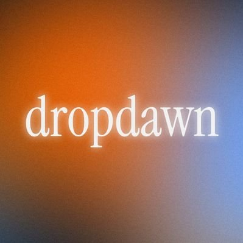

# Dropdawn

AI-powered chat workspace featuring some integrated tools like web search, PDF generation, and more.

## Tech Stack

- **Framework**: Next.js 14, TypeScript
- **Styling**: Tailwind CSS, Framer Motion, Shadcn UI
- **AI**: Vercel AI SDK
- **Backend & Auth**: Supabase

## Environmental Variables

Create a `.env` file in the root directory:

```bash
# Supabase
NEXT_PUBLIC_SUPABASE_URL=your_supabase_url
NEXT_PUBLIC_SUPABASE_ANON_KEY=your_supabase_anon_key
SUPABASE_SERVICE_ROLE_KEY=your_service_role_key

# AI Providers
GOOGLE_GENERATIVE_AI_API_KEY=your_gemini_key
MISTRAL_API_KEY=your_mistral_key
COHERE_API_KEY=your_cohere_key

# Tools
TAVILY_API_KEY=your_tavily_key
```

## Running Locally

1. **Install dependencies**:
   ```bash
   npm install
   ```

2. **Run the development server**:
   ```bash
   npm run dev
   ```

3. **Open the app**:
   Visit [http://localhost:3000](http://localhost:3000)
