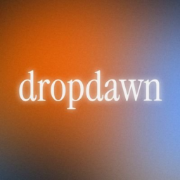

<div align="center">
  
</div>

# Dropdawn

AI-powered chat workspace with a suite of built-in tools — web search, document/presentation/chart generation, static site deployment, and more. Built for speed and flexibility.

## Tech Stack

- **Framework**: Next.js 16, TypeScript
- **Styling**: Tailwind CSS, Framer Motion, Shadcn UI
- **AI**: Vercel AI SDK (Anthropic, Mistral, Google, Cohere, DeepInfra, OpenAI)
- **Backend & Auth**: Supabase (Postgres + Auth)
- **Tools/Libraries**: Tavily (search), Cloudinary (image uploads), jsPDF (PDF/invoice), pptxgenjs (PowerPoint), Recharts (charts), Netlify API (static site deploy)

## Capabilities

Dropdawn is a chat assistant with the following tools. Type `:` in the chat box to browse them and insert an example prompt.

| Tool | What it does |
| --- | --- |
| Calculate | Arithmetic and quick math |
| Weather | Current weather for any location |
| Web Search | Live web results via Tavily |
| PDF Generator | Downloadable text PDFs |
| Invoice Generator | Downloadable invoice PDFs |
| PowerPoint Generator | Text-based `.pptx` decks with design templates + slide preview |
| Stats & Charts | Interactive bar/line/area/pie charts with hover + PNG export |
| Currency Converter | Live exchange-rate conversion (no key) |
| Dictionary | English word definitions (no key) |
| Screenshot | Capture a screenshot of a URL |
| Portfolio | Generate a portfolio URL from a GitHub username |
| Landing Page Generator | Generate & deploy a **static** (HTML/CSS/JS) site to Netlify |
| Manage Site | Update subdomain, roll back, or delete a deployed site |

> **Not supported:** image generation, and any backend/server-side site features — site generation is static-only.

## Prerequisites

Before you begin, ensure you have the following installed on your machine:

- **Node.js**: Version 20.x or later recommended (LTS). [Download Node.js](https://nodejs.org/)
- **Git**: To clone the repository. [Download Git](https://git-scm.com/)
- **npm** (comes with Node.js) or **yarn** / **pnpm** package managers.

## Getting Started

Follow these steps to get a local copy up and running.

### 1. Clone the Repository

Open your terminal and run the following command to clone the repo:

```bash
git clone https://github.com/bikash1376/dawn.git
cd dawn
```

> **Note**: Replace the URL with the specific repository URL if different.

### 2. Install Dependencies

Install the project dependencies using npm:

```bash
npm install
# or
yarn install
# or
pnpm install
```

### 3. Configure Environment Variables

Create a file named `.env.local` in the root directory and add the variables below
(you only need keys for the providers/tools you intend to use). The default chat
model is **Mistral**, so `MISTRAL_API_KEY` is the minimum to start chatting.

```bash
# Supabase
NEXT_PUBLIC_SUPABASE_URL=your_supabase_url
NEXT_PUBLIC_SUPABASE_ANON_KEY=your_supabase_anon_key

# AI Model Providers (add the ones you use)
MISTRAL_API_KEY=your_mistral_key                 # default model
ANTHROPIC_API_KEY=your_anthropic_key             # for Claude (currently locked in UI)
GOOGLE_GENERATIVE_AI_API_KEY=your_gemini_key
COHERE_API_KEY=your_cohere_key
DEEPINFRA_API_KEY=your_deepinfra_key

# External Tools
TAVILY_API_KEY=your_tavily_key                   # web search
NETLIFY_ACCESS_TOKEN=your_netlify_token          # static site deploys
CLOUDINARYCLOUDNAME=your_cloud_name              # image uploads (screenshots)
CLOUDINARY_API_KEY=your_cloudinary_key
CLOUDINARY_API_SECRET=your_cloudinary_secret
```

> Currency conversion and dictionary tools require **no** API key.

### 4. Run the Development Server

Start the local development server:

```bash
npm run dev
```

Open [http://localhost:3000](http://localhost:3000) with your browser to see the result.

## Contributing

We welcome contributions! usage guide:

1.  **Fork the Project**: Click the 'Fork' button at the top right of the repository page.
2.  **Create your Feature Branch**:
    ```bash
    git checkout -b feature/AmazingFeature
    ```
3.  **Commit your Changes**:
    ```bash
    git commit -m 'Add some AmazingFeature'
    ```
4.  **Push to the Branch**:
    ```bash
    git push origin feature/AmazingFeature
    ```
5.  **Open a Pull Request**: Go to the original repository and click "New Pull Request".

## License

Distributed under the MIT License. See `LICENSE` for more information.
